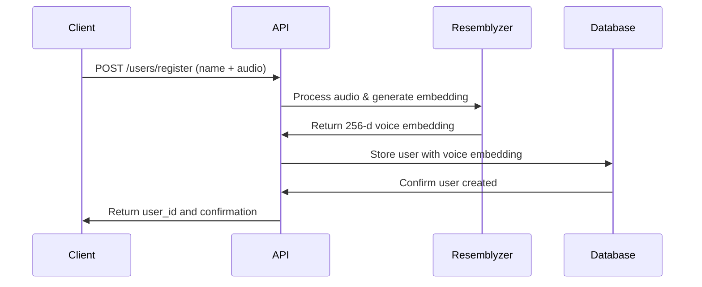
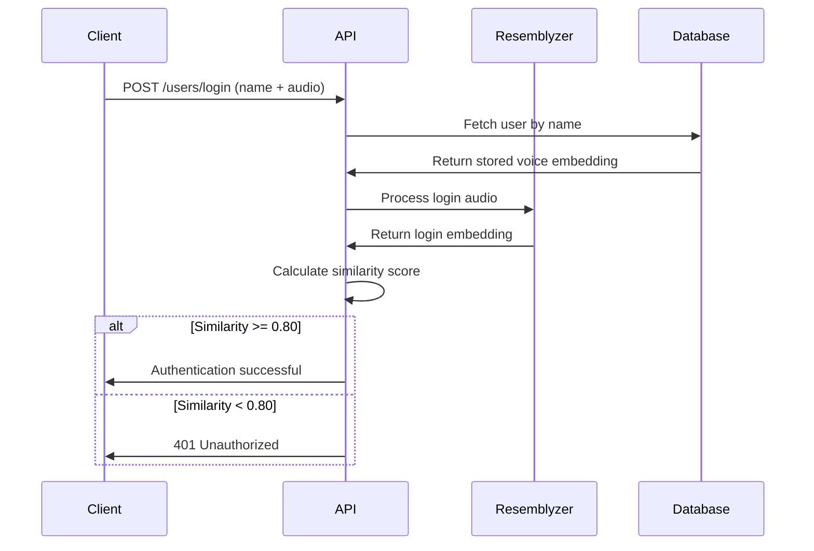

## No Traditional Authentication Required

Unlike most APIs, the Resemblyzer App does not use traditional authentication mechanisms such as:

- API keys
- OAuth tokens
- Bearer tokens
- Session cookies
- Username/password combinations

<Info>
  The authentication **IS** the voice verification itself. Voice biometrics serve as both the identity and the authentication mechanism.
</Info>

## Voice Biometric Authentication

The API uses speaker recognition technology to authenticate users based on their unique vocal characteristics. This approach treats voice patterns as a biometric identifier, similar to fingerprints or facial recognition.

### How It Works

1. **Voice Encoding**: Audio samples are processed using the Resemblyzer library to generate 256-dimensional speaker embeddings
2. **Similarity Calculation**: Embeddings are compared using cosine similarity (inner product of normalized vectors)
3. **Threshold Validation**: The similarity score must meet or exceed the configured threshold for successful authentication

## Registration Flow

Registration creates a new user identity in the system:



**What Happens During Registration:**

1. Client submits a name and audio file (WAV, MP3, or MPEG format)
2. The audio is preprocessed and converted to a standard format
3. Resemblyzer generates a unique voice embedding (numerical representation)
4. The embedding is stored in the database as the user's biometric signature
5. A user ID is returned for reference

<Note>
  The registration process creates the "master" voice embedding that all future login attempts will be compared against.
</Note>

## Login Flow

Login verifies a user's identity by comparing voice samples:



**What Happens During Login:**

1. Client submits the username and a new audio sample
2. The API retrieves the stored voice embedding for that user
3. The login audio is processed to generate a new embedding
4. Similarity is calculated between the stored and new embeddings
5. If similarity meets the threshold, authentication succeeds

## Similarity Threshold

The API uses a **similarity threshold of 0.80** to determine successful authentication:

```python
UMBRAL = 0.80
if similarity < UMBRAL:
    raise HTTPException(status_code=401, detail=f"Acceso denegado. Similitud: {similarity:.4f}")
```

- **Similarity Score Range**: 0.0 to 1.0 (where 1.0 is a perfect match)
- **Required Threshold**: ≥ 0.80
- **Calculation Method**: Inner product (cosine similarity) between normalized embeddings

<Warning>
  If the similarity score is below 0.80, the API returns a 401 Unauthorized error with the actual similarity value in the error message.
</Warning>

## Security Model

### Strengths

- **No Password Storage**: No passwords to leak, hash, or compromise
- **Biometric Security**: Voice patterns are unique and difficult to replicate
- **Continuous Verification**: Each login requires a new audio sample
- **Transparent Scoring**: Similarity scores provide confidence levels

### Considerations

- **Environmental Factors**: Background noise, microphone quality, and recording conditions can affect accuracy
- **Voice Changes**: Illness, fatigue, or aging may impact similarity scores
- **Name-Based Lookup**: The system requires knowing the username to attempt authentication
- **No Rate Limiting**: Current implementation doesn't prevent brute force attempts

<Info>
  The 0.80 threshold balances security with usability. Lower thresholds increase false acceptances (security risk), while higher thresholds increase false rejections (usability issue).
</Info>

## Authentication Response

Successful authentication returns:

```json
{
  "status": "success",
  "message": "Bienvenido [username]",
  "similarity": 0.8542
}
```

Failed authentication returns a 401 error:

```json
{
  "detail": "Acceso denegado. Similitud: 0.7234"
}
```

## Best Practices

1. **Quality Audio**: Use clear audio samples with minimal background noise
2. **Consistent Recording**: Use the same microphone and environment when possible
3. **Sufficient Length**: Provide audio samples with enough speech content for accurate encoding
4. **Error Handling**: Implement retry logic for similarity scores close to the threshold
5. **User Feedback**: Display similarity scores to help users improve their samples

## Example: Complete Authentication Flow

### Step 1: Register

```bash
curl -X POST http://localhost:8000/users/register \
  -F "name=john_doe" \
  -F "audio=@voice_sample.wav"
```

**Response:**
```json
{
  "message": "User created successfully",
  "user_id": 1,
  "name": "john_doe",
  "audio": "voice_sample.wav",
  "audio_type": "audio/wav",
  "embed": [0.123, -0.456, ...]
}
```

### Step 2: Login

```bash
curl -X POST http://localhost:8000/users/login \
  -F "name=john_doe" \
  -F "audio=@new_voice_sample.wav"
```

**Response (Success):**
```json
{
  "status": "success",
  "message": "Bienvenido john_doe",
  "similarity": 0.8542
}
```

**Response (Failure):**
```json
{
  "detail": "Acceso denegado. Similitud: 0.7234"
}
```